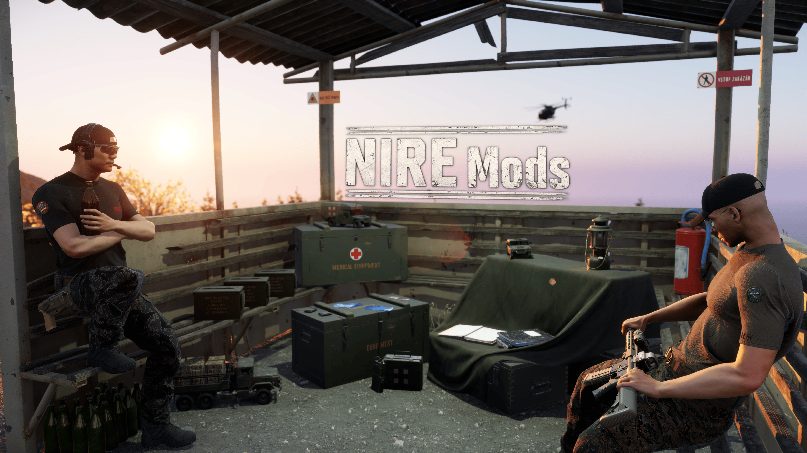

  

# NIRE-Mods

Source code for the Arma Reforger mods published by NIRE. Every mod in this
repository is one Enfusion Workbench addon in its own top-level folder, exactly
as it is laid out inside `My Games/ArmaReforgerWorkbench/addons`.

The repository exists because these mods are distributed under the GNU General
Public License, version 2, which requires the source to be available to anyone
who receives the mod.

## Mods

| Folder | Addon ID | GUID | What it does |
| --- | --- | --- | --- |
| [`DisableGlobalChat`](DisableGlobalChat) | `DisableGlobalChat` | `CA1692B7508A4E1E` | Server-authoritative text chat control. Game Masters and admins enable or disable individual chat channels; voice chat is untouched. |
| [`Expanded Saline Bags`](Expanded%20Saline%20Bags) | `ExpandedSalineBags` | `6A05287AF042071B` | US and USSR saline bags from 250 ml to 1500 ml, with interruptible transfusion and reusable remainders in 250 ml steps. |
| [`GMVehicleLock`](GMVehicleLock) | `GMVehicleLock` | `A83D91C74F2E6B50` | Lets a Game Master lock and unlock vehicles. Locked vehicles cannot be entered on any seat; the state is replicated to clients and to late joiners. |
| [`InventoryBoxes`](InventoryBoxes) | `InventoryBoxes` | `A1E6470C8DBF3952` | Physical crates with finite inventories. Crates are filled by Game Masters, opened by players, carried, dragged and loaded into vehicles, all validated server-side. |
| [`RAMI_AdvancedMedicalInterface`](RAMI_AdvancedMedicalInterface) | `RAMI_AdvancedMedicalInterface` | `D36C5B996922FFDE` | Controller-ready UI layer for ACE Medical. Shows ACE patient data and delegates treatment to existing ACE and engine actions; ACE stays authoritative. |
| [`AMI - ACE Breathing Compat`](AMI%20-%20ACE%20Breathing%20Compat) | `AMI_ACE_Breathing_Compat` | `6A2CBB1E9543DD6F` | Compatibility addon between Advanced Medical Interface and ACE Medical Breathing. |
| [`ServerRulesQuiz`](ServerRulesQuiz) | `ServerRulesQuiz` | `5C3B9E8A7D1F4C2B` | Server rules gate. Players read the configured rules and pass a JSON-defined multiple-choice quiz before they clear server access, with persistent per-player tracking, admin chat commands and configurable retry limits. |
| [`WalkingSpeedIndicator`](WalkingSpeedIndicator) | `WalkingSpeedIndicator` | `6A1E9F43B2C74D18` | Snaps mouse-wheel walking speed to three fixed tiers and shows the active pace in a small fading HUD indicator, so a squad can hold a common speed. |

Most mod folders carry their own changelog, and several carry a README or a
Workshop description with the full feature list and the mod dependencies.

## Building a mod

1. Clone this repository somewhere outside your Workbench `addons` folder, or
   clone it straight into `addons` if you want to work on the mods in place.
2. Open the mod's `.gproj` (`addon.gproj` or `<ModName>.gproj`) in the Arma
   Reforger Tools Workbench.
3. Workbench regenerates `resourceDatabase.rdb` on first load. That file, and
   `Scripts/WorkbenchGame`, are intentionally not tracked here.
4. New or renamed files need a resource database rescan in Workbench before
   they show up in a packed build.

Mods that depend on other mods (see the table above and each mod's own docs)
need those dependencies present in Workbench before the project will load.

## Contributing

The `main` branch is protected. Fork the repository, push your work to a branch
on your fork, and open a pull request against `main`. See
[CONTRIBUTING.md](CONTRIBUTING.md) for the details.

## License

Copyright (C) 2026 NIRE-Mods contributors.

This program is free software; you can redistribute it and/or modify it
under the terms of the GNU General Public License as published by the Free
Software Foundation; version 2 of the License. It is distributed WITHOUT ANY
WARRANTY, without even the implied warranty of MERCHANTABILITY or FITNESS FOR
A PARTICULAR PURPOSE. See [LICENSE](LICENSE) for the full text.

RAMI - Advanced Medical Interface bundles page-tab icons adapted from ACE3
artwork under the same license; the source, revision and modification notice are
in
[`RAMI_AdvancedMedicalInterface/THIRD_PARTY_NOTICES.md`](RAMI_AdvancedMedicalInterface/THIRD_PARTY_NOTICES.md).
